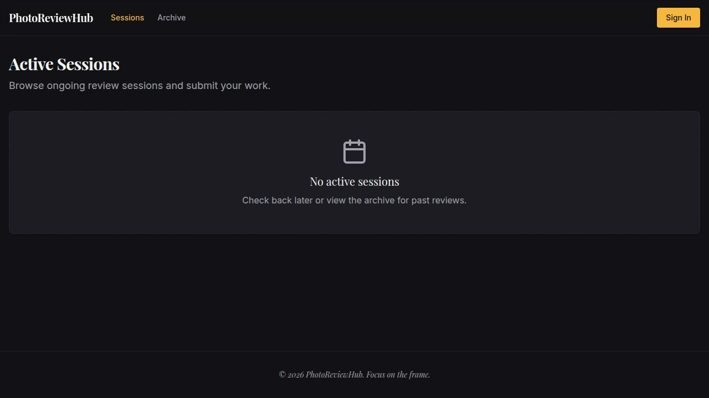

# Foto-Delen-Hub

A monorepo containing two photography web applications and a shared API server, built for Dutch photography clubs.

---

## Applications

### 📷 PhotographersHub

A public-facing portfolio platform where photographers can share their work, organised by clubs and themes. Members sign in with Clerk, manage their own photos and profile, and can propose new themes.

**Key features:**
- Photo gallery with theme and club filters
- Photographer profiles with club memberships (many-to-many)
- Theme-based collections with contributor counts
- Photo upload with URL import support
- Likes and comments on photos
- Theme proposal workflow (photographer proposes → admin approves)
- Invite-token based registration
- Dutch / English i18n
- Admin panel for managing photographers, clubs, themes, and invites

### 🎞️ PhotoReviewHub

A structured peer-review platform for club members. Admins create timed sessions; photographers submit photos; designated reviewers leave star ratings and written feedback.

**Key features:**
- Review sessions with open → reviewing → closed lifecycle
- Per-session submission deadlines and photo limits
- Star ratings (1–5) and written reviews per photo
- Archive of past sessions
- Clerk authentication for photographers; session-based login for admins

---

## Screenshots

### PhotographersHub — Home


### PhotographersHub — Photographers


### PhotographersHub — Themes


### PhotoReviewHub — Sessions


---

## Architecture

```
Foto-Delen-Hub/
├── artifacts/
│   ├── photoclub/        # PhotographersHub — React + Vite frontend
│   ├── review-club/      # PhotoReviewHub   — React + Vite frontend
│   ├── api-server/       # Shared Express API (REST + OpenAPI)
│   └── tech-deck/        # Technical slide deck (internal reference)
└── lib/
    ├── db/               # Drizzle ORM schema + PostgreSQL client
    ├── api-spec/         # OpenAPI 3.1 specification (openapi.yaml)
    ├── api-zod/          # Zod schemas generated from OpenAPI spec
    └── api-client-react/ # React Query hooks generated from OpenAPI spec
```

**Stack:**
- **Frontend:** React 19, Vite, Tailwind CSS, shadcn/ui, TanStack Query
- **Backend:** Node.js, Express, Drizzle ORM
- **Database:** PostgreSQL (Replit managed)
- **Auth:** Clerk (photographers) + session-based (admins)
- **Storage:** Replit Object Storage (photo uploads and URL imports)
- **Package manager:** pnpm workspaces

---

## Database Schema

### `photographers`
| Column | Type | Notes |
|---|---|---|
| `id` | serial PK | |
| `name` | text | |
| `bio` | text | |
| `avatar_url` | text | |
| `theme_id_1` | integer | First preferred theme |
| `theme_id_2` | integer | Second preferred theme |
| `clerk_user_id` | text | Links to Clerk account |
| `created_at` | timestamp | |

### `photographer_clubs` *(junction)*
| Column | Type | Notes |
|---|---|---|
| `photographer_id` | integer PK | FK → photographers |
| `club_id` | integer PK | FK → clubs |
| `joined_at` | timestamp | |

> A photographer can belong to multiple clubs.

### `clubs`
| Column | Type | Notes |
|---|---|---|
| `id` | serial PK | |
| `name` | text | |
| `description` | text | |
| `location` | text | |
| `website_url` | text | |
| `logo_url` | text | |
| `year_established` | integer | |
| `created_at` | timestamp | |

### `themes`
| Column | Type | Notes |
|---|---|---|
| `id` | serial PK | |
| `name` | text | |
| `description` | text | |
| `created_at` | timestamp | |

### `photos`
| Column | Type | Notes |
|---|---|---|
| `id` | serial PK | |
| `title` | text | |
| `description` | text | |
| `image_url` | text | |
| `photographer_id` | integer | FK → photographers |
| `club_id` | integer | Club the photo was submitted under |
| `theme_id` | integer | FK → themes |
| `like_count` | integer | Default 0 |
| `created_at` | timestamp | |

### `comments`
| Column | Type | Notes |
|---|---|---|
| `id` | serial PK | |
| `photo_id` | integer | FK → photos |
| `photographer_id` | integer | FK → photographers |
| `body` | text | |
| `created_at` | timestamp | |

### `theme_proposals`
| Column | Type | Notes |
|---|---|---|
| `id` | serial PK | |
| `name` | text | |
| `description` | text | |
| `proposed_by_photographer_id` | integer | FK → photographers (nullable for admin proposals) |
| `status` | text | `pending` / `approved` / `rejected` |
| `created_at` | timestamp | |

### `admins`
| Column | Type | Notes |
|---|---|---|
| `id` | serial PK | |
| `clerk_user_id` | text | Optional Clerk link |
| `display_name` | text | |
| `email` | text | |
| `password_hash` | text | For session-based login |
| `is_owner` | boolean | Owner admins cannot be removed |
| `added_at` | timestamp | |

### `invite_tokens`
| Column | Type | Notes |
|---|---|---|
| `id` | serial PK | |
| `token` | text | Unique registration token |
| `label` | text | Human-readable description |
| `created_by_admin_id` | integer | FK → admins |
| `max_uses` | integer | Null = unlimited |
| `use_count` | integer | |
| `expires_at` | timestamp | |
| `revoked` | boolean | |
| `created_at` | timestamp | |

### `review_sessions`
| Column | Type | Notes |
|---|---|---|
| `id` | serial PK | |
| `club_id` | integer | FK → clubs |
| `title` | text | |
| `description` | text | |
| `status` | text | `open` / `reviewing` / `closed` |
| `created_by_admin_id` | integer | FK → admins |
| `scheduled_for` | timestamp | |
| `submission_deadline` | timestamp | |
| `max_photos_per_member` | integer | |
| `created_at` | timestamp | |
| `closed_at` | timestamp | |

### `session_photos`
| Column | Type | Notes |
|---|---|---|
| `id` | serial PK | |
| `session_id` | integer | FK → review_sessions |
| `photo_id` | integer | FK → photos |
| `photographer_id` | integer | FK → photographers |
| `sort_order` | integer | Admin-controlled display order |
| `submitted_at` | timestamp | |

### `session_reviewers`
| Column | Type | Notes |
|---|---|---|
| `id` | serial PK | |
| `session_id` | integer | FK → review_sessions |
| `photographer_id` | integer | FK → photographers |
| `added_at` | timestamp | |

### `photo_reviews`
| Column | Type | Notes |
|---|---|---|
| `id` | serial PK | |
| `session_photo_id` | integer | FK → session_photos |
| `reviewer_photographer_id` | integer | FK → photographers |
| `rating` | integer | 1–5 stars |
| `comment` | text | |
| `created_at` | timestamp | |
| `updated_at` | timestamp | |

---

## Entity Relationship Overview

```
clubs ──────────────── photographer_clubs ─── photographers
  │                                                  │
  │                                           theme_id_1 / theme_id_2
  │                                                  │
  └── review_sessions                             themes ◄── theme_proposals
            │                                       │
        session_photos ◄── photos ──────────────────┘
            │          │
     session_reviewers  └── comments
            │
       photo_reviews
```
