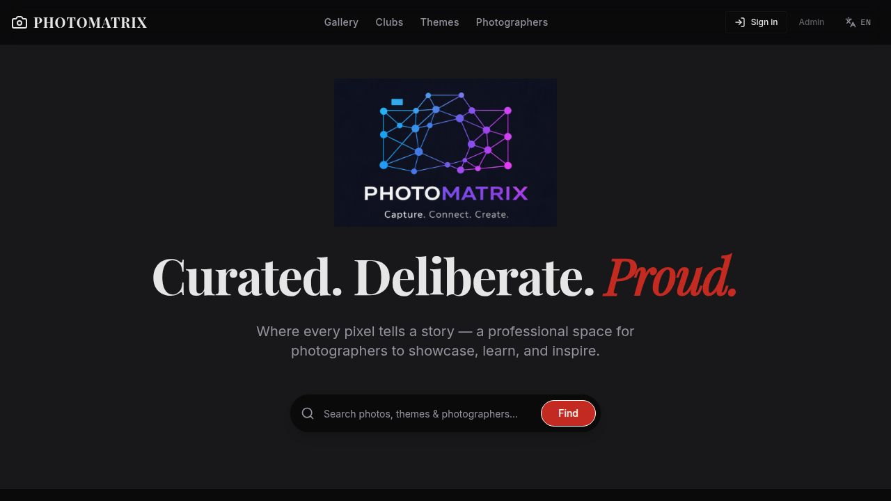
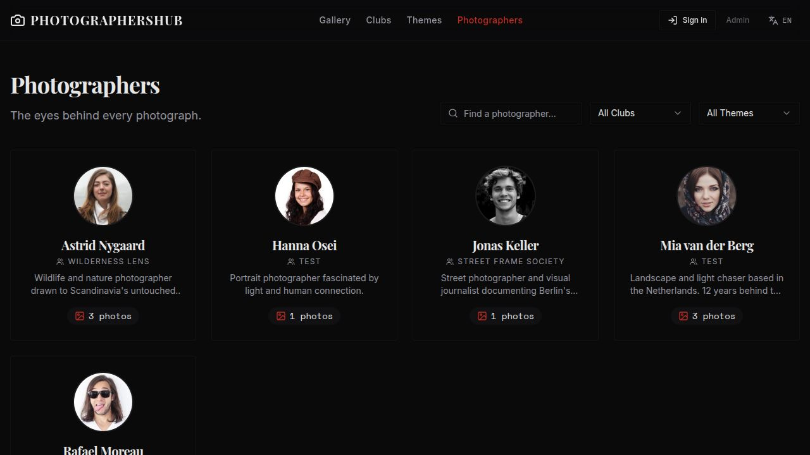
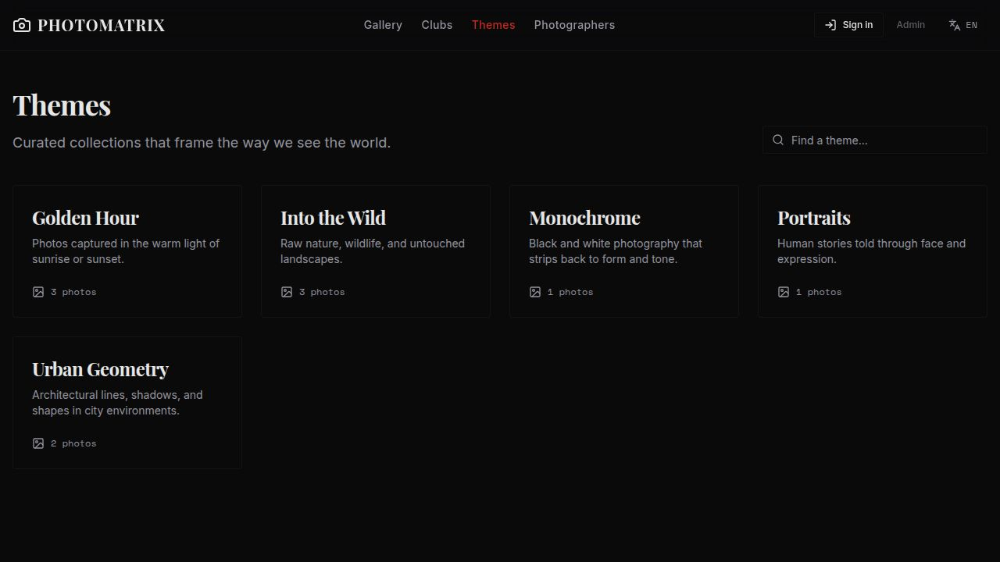

# PhotoMatrix

A photography club platform where members share their work, organised by clubs and themes.

---

## Application

### 📷 PhotoMatrix

A public-facing portfolio platform where photographers can share their work, organised by clubs and themes. Members sign in with Clerk, manage their own photos and profile, and can propose new themes.

**Key features:**
- Photo gallery with theme and club filters
- Photographer profiles with club memberships (many-to-many)
- Preferred themes per photographer (many-to-many)
- Theme-based collections with contributor counts
- Photo upload with URL import support
- Likes and comments on photos
- Theme proposal workflow (photographer proposes → admin approves or rejects → email notification sent)
- Photographers can withdraw their own pending proposals
- Invite-token based registration
- Dutch / English i18n
- Admin panel for managing photographers, clubs, themes, and invites
- Installable as a PWA (Add to Home Screen on Android and iOS)

---

## Screenshots

### PhotoMatrix — Home


### PhotoMatrix — Photographers


### PhotoMatrix — Themes


---

## Architecture

```
PhotoMatrix-monorepo/
├── artifacts/
│   ├── photoclub/        # PhotoMatrix — React + Vite frontend
│   ├── api-server/       # Express API (REST)
│   └── tech-deck/        # Technical slide deck (internal reference)
└── lib/
    ├── db/               # Drizzle ORM schema + PostgreSQL client
    ├── api-spec/         # OpenAPI 3.1 specification (openapi.yaml)
    ├── api-zod/          # Zod schemas generated from OpenAPI spec
    └── api-client-react/ # React Query hooks generated from OpenAPI spec
```

**Stack:**
- **Frontend:** React 19, Vite, Tailwind CSS, shadcn/ui, TanStack Query
- **Backend:** Node.js, Express, Drizzle ORM
- **Database:** PostgreSQL (Replit managed)
- **Auth:** Clerk (photographers) + session-based (admins)
- **Storage:** Replit Object Storage (photo uploads and URL imports)
- **Email:** Resend (proposal approval/rejection notifications)
- **Package manager:** pnpm workspaces

---

## Database Schema

### `photographer`
| Column | Type | Notes |
|---|---|---|
| `id` | serial PK | |
| `name` | text | |
| `bio` | text | |
| `avatar_url` | text | |
| `clerk_user_id` | text | Links to Clerk account |
| `created_at` | timestamp | |

### `photographer_club` *(junction)*
| Column | Type | Notes |
|---|---|---|
| `photographer_id` | integer PK | FK → photographer |
| `club_id` | integer PK | FK → club |
| `joined_at` | timestamp | When the DB record was created |
| `member_since` | integer | Year the photographer joined this club (e.g. 2019) |

> A photographer can belong to multiple clubs.

### `photographer_theme` *(junction)*
| Column | Type | Notes |
|---|---|---|
| `photographer_id` | integer PK | FK → photographer |
| `theme_id` | integer PK | FK → theme |
| `added_at` | timestamp | |

> A photographer can have any number of preferred themes.

### `club`
| Column | Type | Notes |
|---|---|---|
| `id` | serial PK | |
| `name` | text | |
| `description` | text | |
| `location` | text | |
| `website_url` | text | |
| `logo_url` | text | |
| `year_established` | integer | |
| `created_at` | timestamp | |

### `theme`
| Column | Type | Notes |
|---|---|---|
| `id` | serial PK | |
| `name` | text | |
| `description` | text | |
| `created_at` | timestamp | |

### `photo`
| Column | Type | Notes |
|---|---|---|
| `id` | serial PK | |
| `title` | text | |
| `description` | text | |
| `image_url` | text | |
| `photographer_id` | integer | FK → photographer |
| `club_id` | integer | Club the photo was submitted under |
| `theme_id` | integer | FK → theme |
| `like_count` | integer | Default 0 |
| `sort_order` | integer | Photographer-controlled display order; `null` falls back to `created_at DESC` |
| `created_at` | timestamp | |

> Each photo belongs to exactly one photographer (direct FK — no junction table). The many-to-many relationships (clubs, themes) are on the *photographer*, not the photo.

### `comment`
| Column | Type | Notes |
|---|---|---|
| `id` | serial PK | |
| `photo_id` | integer | FK → photo |
| `photographer_id` | integer | FK → photographer |
| `body` | text | |
| `created_at` | timestamp | |

### `theme_proposal`
| Column | Type | Notes |
|---|---|---|
| `id` | serial PK | |
| `name` | text | Proposed theme name |
| `description` | text | |
| `proposed_by_photographer_id` | integer | FK → photographer (nullable for admin proposals) |
| `status` | text | `pending` / `approved` / `rejected` |
| `created_at` | timestamp | |

> When approved, a new `theme` row is created and the proposer receives an email notification. Pending proposals can be withdrawn by the proposer.

### `admin`
| Column | Type | Notes |
|---|---|---|
| `id` | serial PK | |
| `clerk_user_id` | text | Optional Clerk link |
| `display_name` | text | |
| `email` | text | |
| `password_hash` | text | For session-based login |
| `is_owner` | boolean | Owner admins cannot be removed |
| `added_at` | timestamp | |

### `invite_token`
| Column | Type | Notes |
|---|---|---|
| `id` | serial PK | |
| `token` | text | Unique registration token |
| `label` | text | Human-readable description |
| `created_by_admin_id` | integer | FK → admin |
| `max_uses` | integer | Null = unlimited |
| `use_count` | integer | |
| `expires_at` | timestamp | |
| `revoked` | boolean | |
| `created_at` | timestamp | |

---

## Entity Relationship Overview

```
admin ◄──── invite_token

club ◄──── photographer_club ────► photographer ◄──── photographer_theme ────► theme
                (junction)               ▲                  (junction)              ▲
                                         │                               theme_proposal
                                         │                            (──► photographer)
                                photo (──► photographer, ──► club, ──► theme)
                                    ▲
                                comment (──► photo, ──► photographer)
```

Arrow direction: `A ──► B` means A holds a FK to B (A references B).
